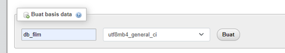
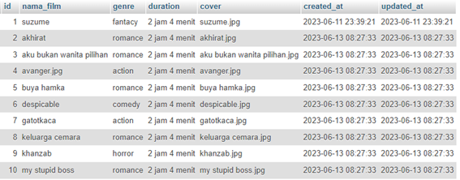
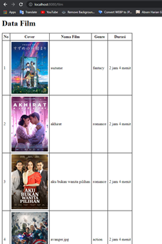
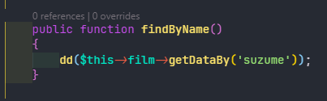
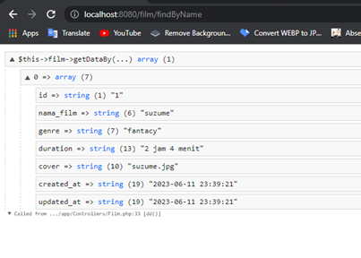
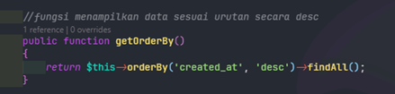
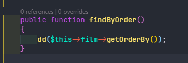
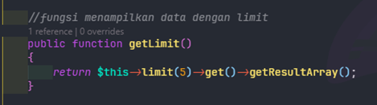
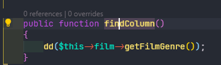
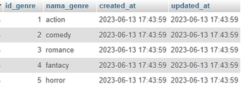

# PHP_Framework-Bekerja_dengan_Database
## A. Tujuan (Capaian Pembelajaran)
Setelah praktikum ini, praktikan diharapkan dapat:  
1.	Mampu menginstal codeigniter  
2.	Mengenal php framework  
## B. Peralatan yang digunakan  
1.	Arch Linux  
2.	Codeigniter 4  
3.	Xampp  
4.	WPS Office  
5.	Code  
## C. Landasan teori  
A.	Database mySQL phpmyadmin  
`PHPMyAdmin adalah aplikasi berbasis web yang digunakan untuk mengelola dan mengelola basis data MySQL melalui antarmuka grafis yang intuitif. Dibangun dengan menggunakan bahasa pemrograman PHP, PHPMyAdmin menyediakan berbagai fitur yang memudahkan pengguna dalam melakukan tugas administrasi pada basis data.  `
1.	Antarmuka Pengguna yang Intuitif: PHPMyAdmin memiliki antarmuka pengguna yang mudah dipahami dan mudah digunakan. Melalui antarmuka ini, pengguna dapat mengakses dan mengelola basis data MySQL dengan cepat dan efisien. Pengguna dapat menjelajahi struktur tabel, mengedit data, menjalankan query SQL, dan melakukan tugas administrasi lainnya dengan mudah.  
2.	Manajemen Tabel: Dalam PHPMyAdmin, pengguna dapat membuat, mengubah, dan menghapus tabel dalam basis data MySQL. Pengguna dapat mendefinisikan kolom-kolom tabel, tipe data, konstrain, dan indeks yang diperlukan. Fitur ini memungkinkan pengguna untuk dengan mudah merancang dan mengatur struktur tabel sesuai dengan kebutuhan aplikasi.  
3.	Eksekusi Query SQL: PHPMyAdmin menyediakan antarmuka untuk mengeksekusi query SQL langsung. Pengguna dapat menulis perintah SQL untuk membuat, mengubah, dan menghapus data dalam tabel. Hal ini memungkinkan pengguna untuk memiliki kontrol penuh atas manipulasi data dan operasi basis data.  
4.	Impor dan Ekspor Data: PHPMyAdmin memungkinkan pengguna untuk mengimpor dan mengekspor data dalam berbagai format. Pengguna dapat mengimpor data dari file eksternal ke dalam basis data MySQL, serta mengekspor data dari tabel atau seluruh basis data ke file eksternal. Fitur ini sangat membantu dalam mentransfer data antara basis data, melakukan backup, dan mengintegrasikan dengan alat atau aplikasi lain.  
5.	Pengelolaan Pengguna dan Hak Akses: PHPMyAdmin memungkinkan pengguna untuk membuat, mengubah, dan menghapus pengguna dalam basis data MySQL. Pengguna juga dapat mengatur hak akses untuk masing-masing pengguna, termasuk hak akses untuk tabel-tabel tertentu. Fitur ini memungkinkan pengguna untuk mengelola keamanan dan kontrol akses basis data.  
6.	Visualisasi Data dan Manipulasi: PHPMyAdmin menyediakan tampilan tabel yang intuitif dan fitur pencarian yang kuat. Pengguna dapat melihat dan memanipulasi data dalam tabel dengan mudah, termasuk mengurutkan, menyaring, dan mengedit data. Fitur visualisasi ini membantu pengguna dalam menganalisis dan memahami isi basis data.  
7.	Pemeliharaan dan Optimisasi Basis Data: PHPMyAdmin menyediakan fitur pemeliharaan dan optimisasi basis data. Pengguna dapat memperbaiki tabel yang rusak, mengoptimalkan struktur tabel, menganalisis kinerja query, dan mengatur pengaturan server MySQL. Fitur ini membantu pengguna dalam menjaga kinerja dan keandalan basis data.  
PHPMyAdmin merupakan alat yang sangat berguna bagi pengembang web dan administrator basis data. Dengan antarmuka yang intuitif dan fitur-fitur yang lengkap, PHPMyAdmin memudahkan pengguna dalam mengelola, mengatur, dan memanipulasi basis data MySQL dengan efisien.  
## D. Hasil dan Pembahasan  
1.	Membuat database di phpMyAdmin db_film  
  
2.	Membuat table Bernama film dengan jumlah 7 colom  
  
3.	Mengisi 10 data film ke dalam table  
  
4.	Pada file .env kemarin cari baris database, lalu uncomment baris line 33 sampai 39. Kemudian konfigurasi seperti ini  
 
5.	Membuat file model Filmmodel.php  
```php
<?php
namespace App\Models;

use CodeIgniter\Model;

class FilmModel extends Model
{
    protected $table            = 'film';
    protected $primaryKey       = 'id';
    protected $useAutoIncrement = true;
    protected $allowField       = [];

    public function getAllData()
    {
        return $this->findAll();
    }
}


```  
•	protected $table = 'film'; : property ini mendeklarasikan tabel database yang digunakan oleh model.  
•	protected $primaryKey = 'id'; : property ini mendeklarasikan kolom yang digunakan sebagai kunci primer dalam tabel.  
•	protected $useAutoIncrement = true; : property ini menentukan apakah kunci primer adalah auto-increment atau tidak. Dalam hal ini, id adalah auto-increment.  
•	protected $allowField = []; : property Ini mendeklarasikan field apa saja yang diperbolehkan untuk diisi ketika melakukan operasi insert atau update. Dalam hal ini, array tersebut kosong, yang berarti tidak ada field yang diizinkan untuk diisi, update, delete.  
6.	Membuat file controller Film.php  
```php
<?php
namespace App\Controllers;

use App\Controllers\BaseController;
use App\Models\FilmModel;

class Film extends BaseController
{
    protected $film;

    public function __construct()
    {
        $this->film = new FilmModel();
    }

    public function index()
    {
        $data['data_film'] = $this->film->getAllData();
        return view("film/index", $data);
    }
}
```  
7.	Setelah membuat model dan controller nya sekarang buat file view nya index.php di folder view  
```html
<html lang="en">

<head>
    <meta charset="UTF-8">
    <meta http-equiv="X-UA-Compatible" content="IE=edge">
    <meta name="viewport" content="width=device-width, initial-scale=1.0">
    <title>Document</title>
</head>

<body>
    <h1>Data Film</h1>
    <table border="1" cellspacing="0" cellpadding="5">
        <tr>
            <th>No</th>
            <th>Cover</th>
            <th>Nama Film</th>
            <th>Genre</th>
            <th>Durasi</th>
        </tr>
        <?php $i = 1; ?>
        <?php foreach ($data_film as $row) : ?>
            <tr>
                <td><?= $i++; ?></td>
                <td>" alt="" srcset=""></td>
                <td><?= $row['nama_film'] ?></td>
                <td><?= $row['genre'] ?></td>
                <td><?= $row['duration'] ?></td>
            </tr>
        <?php endforeach; ?>
    </table>
</body>

</html>
```  
kemudian akses https://localhost:8080/film/ dibrowser  
  
8.	Menampilkan data berdasarkan Id dengan menggunakan fungsi find()  
•	Tambahkan syntak ini ke dalam model Filmmodel.php  
  
•	Kemudian tambahkan syntak ini ke dalam controller untuk dipanggil dengan dd  
  
•	Kemudian akses http://localhost:8080/film/findById pada browser  
  
9.	Menampilkan data dengan kondisi mencari kolom nama_film  
•	Tambahkan syntak ini ke dalam model Filmmodel.php  
  
•	Kemudian tambahkan syntak ini ke dalam controller untuk dipanggil dengan dd  
  
•	Kemudian akses http://localhost:8080/film/findByName pada browser  
  
10.	Menampilkan data menggunakan fungsi orderBy  
•	Tambahkan syntak ini ke dalam model Filmmodel.php  
  
•	Kemudian tambahkan syntak ini ke dalam controller untuk dipanggil dengan dd  
  
•	Kemudian akses http://localhost:8080/film/findByOrder pada browser  
  
11.	Menampilkan data dengan fungsi limit, fungsi ini membatasi jumlah data yang akan ditampilkan  
•	Tambahkan syntak ini ke dalam model Filmmodel.php  
  
•	Kemudian tambahkan syntak ini ke dalam controller untuk dipanggil dengan dd  
  
•	Kemudian akses http://localhost:8080/film/findLimit pada browser  
  
12.	Menampilkan data dengan fungsi builder, dengan fungsi ini kita dapat menampilkan data hanya untuk kolom tertentu  
•	Tambahkan syntak ini ke dalam model Filmmodel.php  
  
•	Kemudian tambahkan syntak ini ke dalam controller untuk dipanggil dengan dd  
  
•	Kemudian akses http://localhost:8080/film/findColumn pada browser  
   
E. Tugas  
1.	Buat table genre di database db_film kemudian isi datanya  
   
   
2.	Menampilkan data genre di halaman html, jika untuk di menampilkan data film kita film/all untuk menampilkan data genre aksesnya adalah genre/all  
•	Buat file model GenreModel.php  
```php
<?php

namespace App\Models;

use CodeIgniter\Model;

class GenreModel extends Model
{
    protected $table            = 'genre';
    protected $primaryKey       = 'id_genre';
    protected $useAutoIncrement = true;
    protected $allowField       = [];

    //fungsi untuk menampilkan semua data dalam table
    public function getAllData()
    {
        return $this->findAll();
    }
}
```  
•	Buat file controller Genre.php  
```php
<?php

namespace App\Controllers;

use App\Controllers\BaseController;

use App\Models\GenreModel;

class Genre extends BaseController
{
    protected $genre;

    public function __construct()
    {
        $this->genre = new GenreModel();
    }

    public function all()
    {
        $data['genre'] = $this->genre->getAllData();
        return view("film/genre", $data);
    }
}
```  
•	Membuat view di di folder view/genre.php  
```php
<html lang="en">

<head>
    <meta charset="UTF-8">
    <meta http-equiv="X-UA-Compatible" content="IE=edge">
    <meta name="viewport" content="width=device-width, initial-scale=1.0">
    <title>Document</title>
</head>

<body>
    <h1>Data Film</h1>
    <table border="1" cellspacing="0" cellpadding="5">
        <tr>
            <th>No</th>
            <th>Nama genre</th>
            <th>Dibuat</th>
            <th>Diupdate</th>
        </tr>
        <?php $i = 1; ?>
        <?php foreach ($genre as $row) : ?>
            <tr>
                <td><?= $i++; ?></td>
                <td><?php echo $row['nama_genre'] ?></td>
                <td><?php echo $row['created_at'] ?></td>
                <td><?= $row['updated_at'] ?></td>
            </tr>
        <?php endforeach; ?>
    </table>
</body>

</html>
```  
•	Kemudian akses http://localhost:8080/genre/all di browser  
   
3.	Kemudian ubah tabel film pada kolom genre menjadi id_genre, isi datanya sesuai dengan data pada tabel genre  
   
4.	saat menjalankan film/all pastikan tidak ada error, artinya codingya harus disesuaikan karena menganti genre manjadi id genre.   
   
