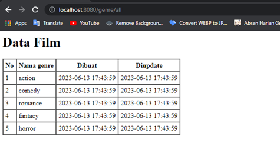
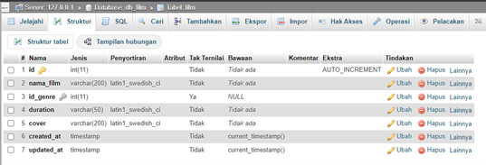
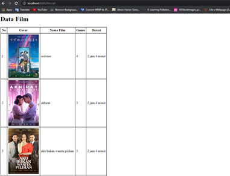

# PHP Framework - Membuat Tampilan Menarik Menggunakan Bootstrap
## A. Tujuan (Capaian Pembelajaran)
Setelah praktikum ini, praktikan diharapkan dapat:  
1.	Mengerti dan mengimplementasikan Bootstrap dalam tampilan web.  
2.	Merancang tampilan web yang responsif menggunakan Bootstrap. 
## B. Peralatan yang digunakan  
1.	Web Editor : Visual Studio Code  
2.	Web Browser : Google Chrome  
3.	OS PC : Arch Linux  
4.	XAMPP : versi 8.2  
5.	CodeIgniter : 4.1.1  
## C. Hasil dan Pembahasan  
1.	Pertama ubah terlebih dahulu default route ubah pada file ``Routes`` di folder ```config```  
  
Setelah kemarin kita sudah membuat table genre dan juga sudah menggantikan colom 
genre pada table film menjadi `id_genre` selanjutnya kita akan melakukan `join` pada 
kedua table tersebut  
2.	Kita buat function `getAllDataJoin` di file model film 
```php
<?php

namespace App\Models;

use CodeIgniter\Model;

class FilmModel extends Model
{
    protected $table = 'film';
    protected $primaryKey = 'id';
    protected $useAutoIncrement = true;
    protected $allowedFields = [];

    public function getAllDataJoin()
    {
        $query = $this->db->table("film")
            ->select("film.*, genre.nama_genre")
            ->join("genre", "genre.id_genre = film.id_genre");

        return $query->get()->getResultArray();
    }

    public function getAllData()
    {
        return $this->findAll();
    }
}

```  
Fungsi `getAllDataJoin()` ini bertugas untuk mengambil semua data dari tabel film dan 
menggabungkannya dengan data dari tabel genre berdasarkan `id_genre`. Jadi, jika kita 
memiliki film dan genre film dalam database kita, fungsi ini akan mengumpulkan 
semua informasi tersebut dan menggabungkannya menjadi satu. Hasilnya, kita akan 
mendapatkan daftar film lengkap dengan genre masing-masing dalam bentuk array.

3.	Setelah itu ubah function method `all` menjadi seperti ini pada file Controller `Film` 
nya menjadi seperti ini
 ```php
<?php

namespace App\Controllers;

use App\Controllers\BaseController;
use App\Models\FilmModel;

class Film extends BaseController
{
    protected $film;

    public function __construct()
    {
        $this->film = new FilmModel();
    }

    public function index()
    {
        $data['dataFilm'] = $this->film->getAllDataJoin();
        return view("film/table", $data);
    }

    public function all()
    {
        $data['data_film'] = $this->film->getAllDataJoin();
        return view("film/index", $data);
    }
}

```  
Method `all()` ini bekerja untuk mengumpulkan semua data film beserta genre masing-masing dari database `(melalui fungsi getAllDataJoin())`, lalu menampilkan data tersebut 
di halaman `film/index`.  
4.	Setelah melakukan konfigurasi seperti diatas sekarng kita akan menggunakan bootraps 5 untuk mempercantik tampilan dan lebih resposnsive. Pertaman download terlebih dahulu bootsraps 5 nya di  https://getbootstrap.com/docs/5.0/getting-started/download  
  
5.	Setelah di download ektrak file nya kemudian copy folder css dan js ke folder `public->assets`. Setelah itu pada file index yang ada di `views` film kita hubungkan ke file css dari bootraps dan javacript nya   
  
6.	Setelah itu kita akan membuat `navbar`, kita bias mencarinya di dokumentasi bootsraps 5 dengan cara mengetikan `navbar` kemudian cari navbar sesuai selera, copy code nya kemudian pastekan ke file php `index`  
  
Lalu kita edit sesuai selera, untuk pengeditan kita bias membaca lebih lanjut dokumentasi dari bootrsaps  
berikut adalah source code `index.php`  
```html
<html lang="en">
<head>
  <meta charset="UTF-8">
  <meta http-equiv="X-UA-Compatible" content="IE=edge">
  <meta name="viewport" content="width=device-width, initial-scale=1.0">
  <title>LK27</title>
  <link rel="stylesheet" href="/assets/css/bootstrap.min.css">
</head>
<body>
  <nav class="navbar navbar-expand-lg navbar-dark bg-dark">
    <div class="container-fluid">
      <a class="navbar-brand" href="#">LK27</a>
      <button class="navbar-toggler" type="button" data-bs-toggle="collapse" data-bs-target="#navbarNav"
        aria-controls="navbarNav" aria-expanded="false" aria-label="Toggle navigation">
        <span class="navbar-toggler-icon"></span>
      </button>
      <div class="collapse navbar-collapse" id="navbarNav">
        <ul class="navbar-nav">
          <li class="nav-item">
            <a class="nav-link" aria-current="page" href="/">Beranda</a>
          </li>
          <li class="nav-item">
            <a class="nav-link" href="/film">Semua Film</a>
          </li>
          <li class="nav-item">
            <a class="nav-link" href="#">Kategori Film</a>
          </li>
          <li class="nav-item">
            <a class="nav-link" href="#">Tentang Kami</a>
          </li>
        </ul>
      </div>
    </div>
  </nav>
  <script src="/assets/js/bootstrap.js"></script>
  <script src="/assets/js/bootstrap.min.js"></script>
</body>
</html>
```  
Kemudian akses https://localhost:8080 dan ini hasilnya  
7.	Setelah berhasil membuat navbar selanjutnya kita akan menampilkan data film menggunakan style card yang ada di bootraps. Setelah tanda tutup nav ketikan kode html seperti ini  
div dengan kelas container yang berfungsi sebagai wadah utama. Di dalam container ini, ada sebuah judul (h1) dengan teks "Daftar Film" yang ditempatkan di tengah (text-center) dan memiliki font weight bold (fw-bold). Judul ini juga memiliki margin atas dan bawah (mt-3 mb-3) untuk memberi jarak dari elemen lain. Selanjutnya, ada div lain dengan kelas row, yang digunakan untuk menampung kolom-kolom dalam layout grid Bootstrap. Di dalam row ini, ada div dengan kelas col-md-4 yang berarti bahwa kolom ini akan mengambil 4 dari 12 kolom tersedia pada layar medium (md) dan lebih besar. 
Selanjutnya copy kode card dari bootraps  
kemudian akses https://localhost:8080/film/ dibrowser  
  
8.	Menampilkan data berdasarkan Id dengan menggunakan fungsi find()  
•	Tambahkan syntak ini ke dalam model Filmmodel.php  
  
•	Kemudian tambahkan syntak ini ke dalam controller untuk dipanggil dengan dd  
  
•	Kemudian akses http://localhost:8080/film/findById pada browser  
  
9.	Menampilkan data dengan kondisi mencari kolom nama_film  
•	Tambahkan syntak ini ke dalam model Filmmodel.php  
  
•	Kemudian tambahkan syntak ini ke dalam controller untuk dipanggil dengan dd  
  
•	Kemudian akses http://localhost:8080/film/findByName pada browser  
  
10.	Menampilkan data menggunakan fungsi orderBy  
•	Tambahkan syntak ini ke dalam model Filmmodel.php  
  
•	Kemudian tambahkan syntak ini ke dalam controller untuk dipanggil dengan dd  
  
•	Kemudian akses http://localhost:8080/film/findByOrder pada browser  
  
11.	Menampilkan data dengan fungsi limit, fungsi ini membatasi jumlah data yang akan ditampilkan  
•	Tambahkan syntak ini ke dalam model Filmmodel.php  
  
•	Kemudian tambahkan syntak ini ke dalam controller untuk dipanggil dengan dd  
  
•	Kemudian akses http://localhost:8080/film/findLimit pada browser  
  
12.	Menampilkan data dengan fungsi builder, dengan fungsi ini kita dapat menampilkan data hanya untuk kolom tertentu  
•	Tambahkan syntak ini ke dalam model Filmmodel.php  
  
•	Kemudian tambahkan syntak ini ke dalam controller untuk dipanggil dengan dd  
  
•	Kemudian akses http://localhost:8080/film/findColumn pada browser  
   
E. Tugas  
1.	Buat table genre di database db_film kemudian isi datanya  
   
   
2.	Menampilkan data genre di halaman html, jika untuk di menampilkan data film kita film/all untuk menampilkan data genre aksesnya adalah genre/all  
•	Buat file model GenreModel.php  
```php
<?php

namespace App\Models;

use CodeIgniter\Model;

class GenreModel extends Model
{
    protected $table            = 'genre';
    protected $primaryKey       = 'id_genre';
    protected $useAutoIncrement = true;
    protected $allowField       = [];

    //fungsi untuk menampilkan semua data dalam table
    public function getAllData()
    {
        return $this->findAll();
    }
}
```  
•	Buat file controller Genre.php  
```php
<?php

namespace App\Controllers;

use App\Controllers\BaseController;

use App\Models\GenreModel;

class Genre extends BaseController
{
    protected $genre;

    public function __construct()
    {
        $this->genre = new GenreModel();
    }

    public function all()
    {
        $data['genre'] = $this->genre->getAllData();
        return view("film/genre", $data);
    }
}
```  
•	Membuat view di di folder view/genre.php  
```php
<html lang="en">

<head>
    <meta charset="UTF-8">
    <meta http-equiv="X-UA-Compatible" content="IE=edge">
    <meta name="viewport" content="width=device-width, initial-scale=1.0">
    <title>Document</title>
</head>

<body>
    <h1>Data Film</h1>
    <table border="1" cellspacing="0" cellpadding="5">
        <tr>
            <th>No</th>
            <th>Nama genre</th>
            <th>Dibuat</th>
            <th>Diupdate</th>
        </tr>
        <?php $i = 1; ?>
        <?php foreach ($genre as $row) : ?>
            <tr>
                <td><?= $i++; ?></td>
                <td><?php echo $row['nama_genre'] ?></td>
                <td><?php echo $row['created_at'] ?></td>
                <td><?= $row['updated_at'] ?></td>
            </tr>
        <?php endforeach; ?>
    </table>
</body>

</html>
```  
•	Kemudian akses http://localhost:8080/genre/all di browser  
   
3.	Kemudian ubah tabel film pada kolom genre menjadi id_genre, isi datanya sesuai dengan data pada tabel genre  
   
4.	saat menjalankan film/all pastikan tidak ada error, artinya codingya harus disesuaikan karena menganti genre manjadi id genre.   
   
